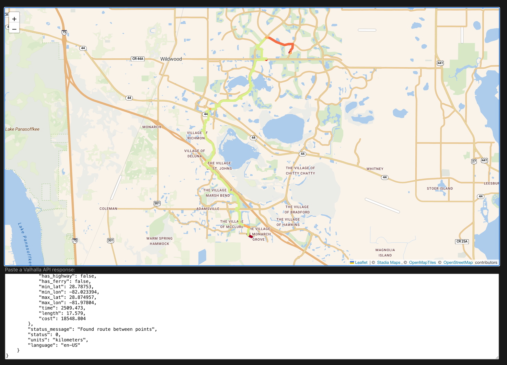

# Ragnarök

This is a tool for debugging and inspecting routing responses from [Valhalla](https://github.com/valhalla/valhalla).
API responses are pretty hard to visualize!
When developing custom routing profiles, we wanted something to quickly visualize the route,
including the relative costs of each maneuver.
So, here it is!

This assuredly has bugs, and has not been tested with much besides fairly "vanilla" route requests.
PRs welcome for improvements.

## How to use?

1. Get a Valhalla route JSON response 
2. Head over to [stadiamaps.github.io/ragnarok](https://stadiamaps.github.io/ragnarok/)
3. Paste it in the data box (and maybe adjust the zoom; it's not very smart)
4. Hover over route segments to inspect each maneuver

## What's Valhalla?

[Valhalla](https://github.com/valhalla/valhalla) is an incredibly flexible routing engine originally developed at Mapzen.
It has long been one of the premier open-source routing engines,
and  it's used by a few companies you may have heard of (like Mapbox and Tesla).

At Stadia Maps, we've been contributors to the project for almost as long as we've been around.
We built this tool to help us debug complex routing issues, particularly the kind we encounter when developing custom routing profiles.
Check out our [routing APIs](https://docs.stadiamaps.com/routing/?utm_source=github&utm_campaign=routing&utm_content=ragnarok)
if you're looking for a routing solution with support.
